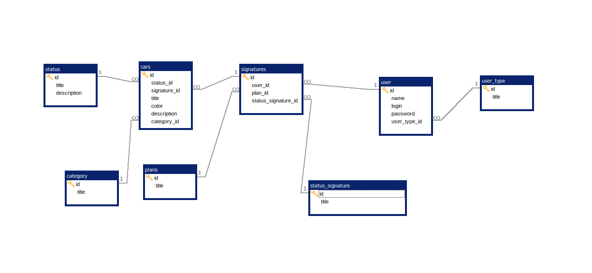

<p align="center"><a href="https://laravel.com" target="_blank"></a></p>

## Projeto carros

Iremos desenvolver um sistema que gerencie os cadastros de um catálogo de carros. Onde, teremos, categorias, status, assinaturas, planos e usuários.

Em teoria, devemos ter um painel onde seja possível fazer os cadastros das informações necessárias para ser exibida no site de carros.

## DER – (Diagrama de Entidade e Relacionamento)
No diagrama abaixo, temos uma prévia de como a base deve ser criada. As tabelas foram pensadas nas informações básicas para ser consumido pela aplicação.


O diagrama não contempla todas as informações necessárias. Deixo a seu critério para completar todas as informações que ache pertinente.

## Requisitos para aceitação:
Linguagem: PHP

Framework Back-end: Laravel na última versão

→ Link: https://laravel.com/docs/9.x

Banco de dados: MySQL na última versão

Framework front-end: Bootstrap na versão 3

→ Link: https://getbootstrap.com/docs/3.3/

## Utilização de Docker:
Como praticamente todas as empresas de hoje em dia já utilizam docker! Desta forma, se torna impressindível a utilização do mesmo.
No link abaixo irei deixar um tutorial para utilizar o docker no windows utilizando o wsl 2

→ link: https://www.youtube.com/watch?v=wpdcGgRY5kk&t=8s

## Executar o projeto

Após ter o docker rodando na sua máquina e baixar esse repositório, basta rodar o comando para iniciar a aplicação

````
    docker-compose up -d
````
Caso apresente algum erro de permissão, rode esse comando

````
 docker exec -it panel-cars  chmod -R 775 storage
````

link da aplicação:
````
http://localhost
````
